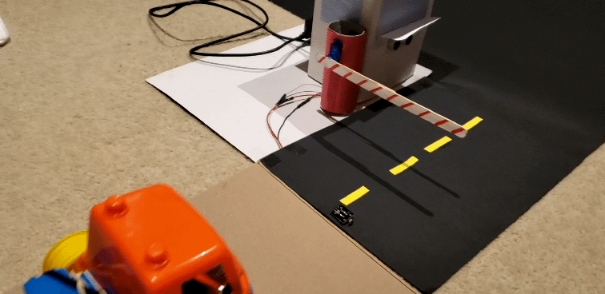

# TicketBooth

Arduino and Raspberry Pi project of a miniature ticket booth.

- The vehicle uses two TT DC motors and an L298N motor drive controller attached to an Arduino UNO
- The ticket booth works with Raspberry PI, a SG90 micro servo motor, HC-SR04 sensor, photoresistor and nice little blue LED.

